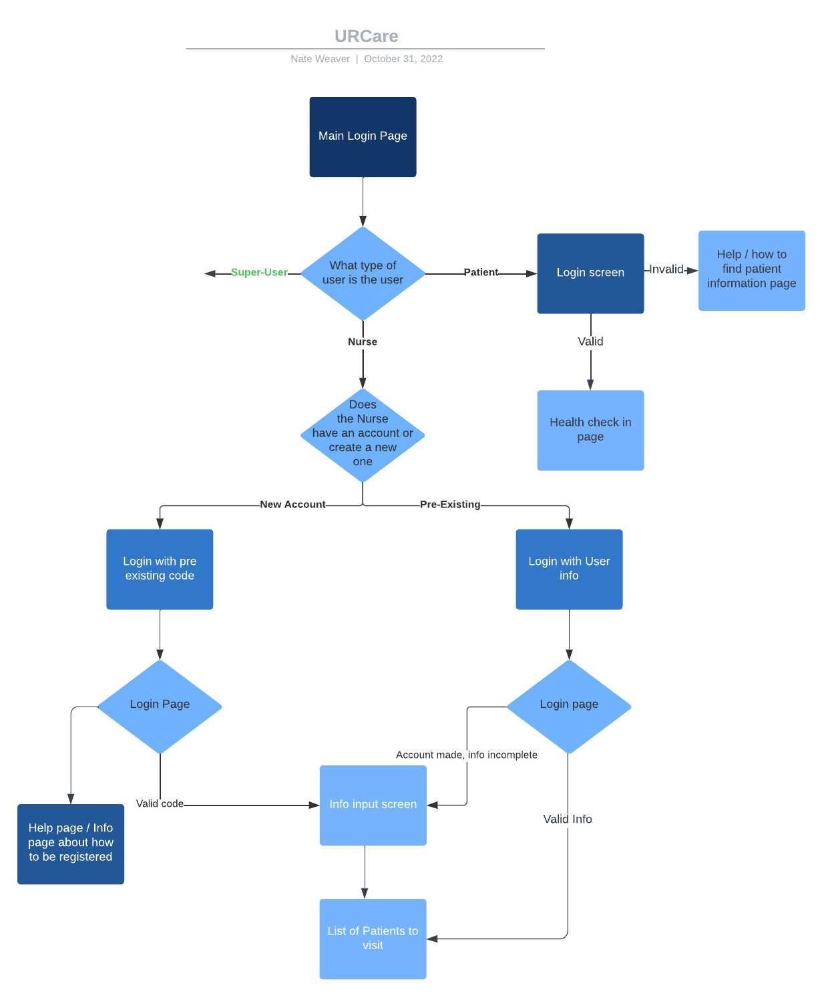
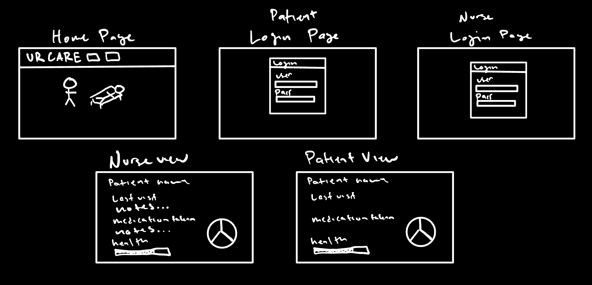

### Team Number: 012-05

### Team name: JANND

### Team Members:
| Name           | Github         | Email                        | Phone          |
|----------------|----------------|------------------------------|----------------|
| Jack McKinstry | @jackmckinstry | jack.mckinstry@colorado.edu  | 720-[redacted] |
| David Ustyan   | @dustyan       | daus7152@colorado.edu        | 720-[redacted] |
| Nate Weaver    | @nweaver412    | nawe1887@colorado.edu        | 412-[redacted] |
| Nick Henley    | @nh602         | nicholas.henley@colorado.edu | 720-[redacted] |
| Aaron Asibbey  | @aaronasibbey  | aaas7295@colorado.edu        | 720-[redacted] |

### Application Name: Homecare Project (working name)

### Application Description:
Our application will be a platform for home-care nursing services. The primary function of the application is to allow for the nurses to provide updates and see services necessary for each patient. Family members will be able to access and see updates on how the patient is doing from the nurse’s given updates. Further, we have a reach goal wherein the management of the firm will have capability to assign nurses to patients based on schedules and necessary care.

### Vision Statement: 
For the families of patients who want to keep track of the health and care of their family. The Homecare Project is a patient management interface that allows nurses to insert notes and updates about the care they give to their patients, and give the families view access to that data so they know they get the care they need. Unlike other agencies, our management interface gives our patient’s families access to this information instead of just the nurses and admin. (if they are given permission of course).

### Version Control (Github repository): https://github.com/jackmckinstry/homecare-project 

### Development Methodology (Github project board): https://github.com/users/jackmckinstry/projects/2/views/1

### Communication Plan: 
We will communicate primarily through a discord server we have created for our team, both for meetings and messaging (along with Zoom). We will also exchange phone numbers in case of urgent communication being necessary.

### Meeting Plan:
Weekly meeting with TA: Monday, 3:15-3:30 PM, via Zoom

Team Meeting: Monday, 3:30-4:30 PM, Discord/Zoom Video Call

### Use Case Diagram: 

### Wireframes: 

